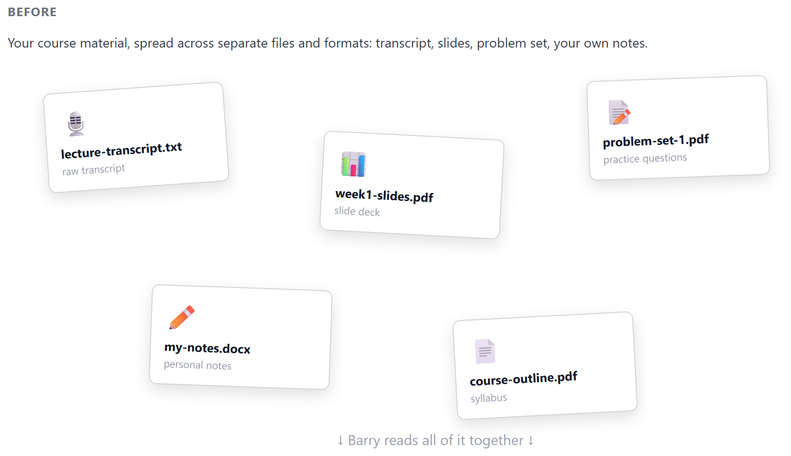
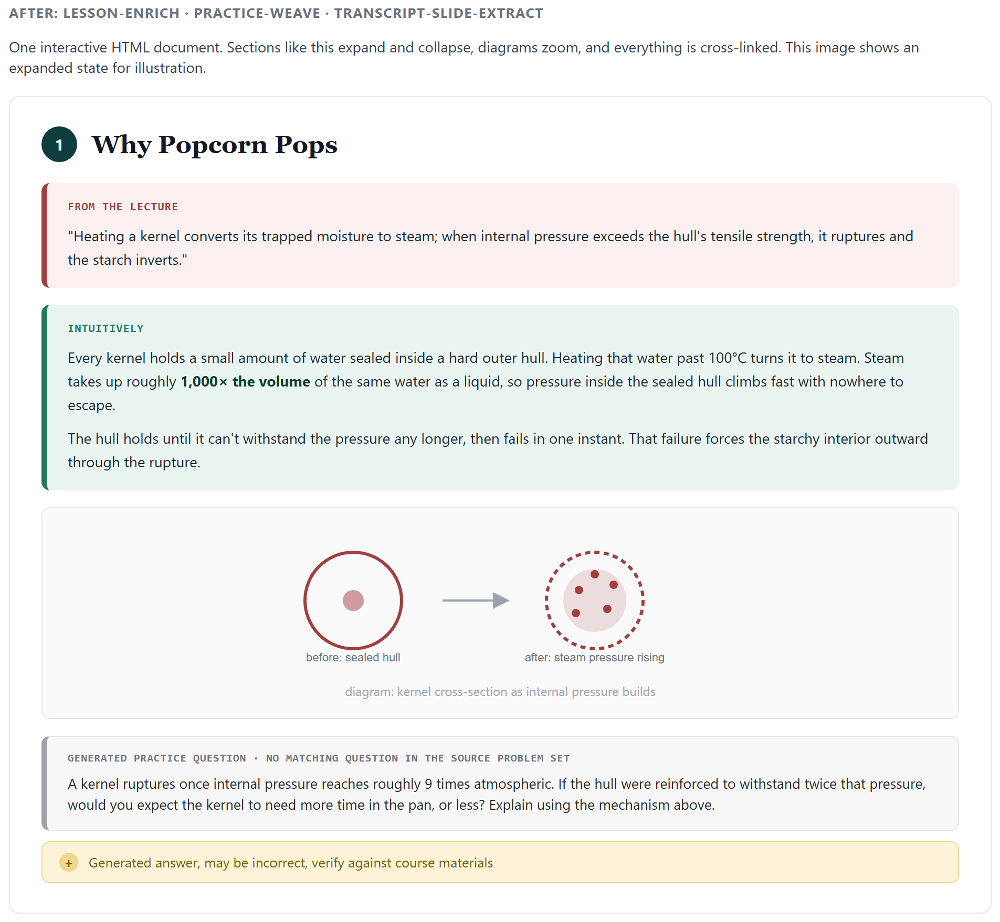
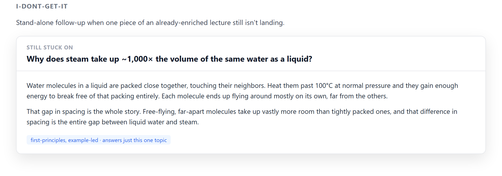
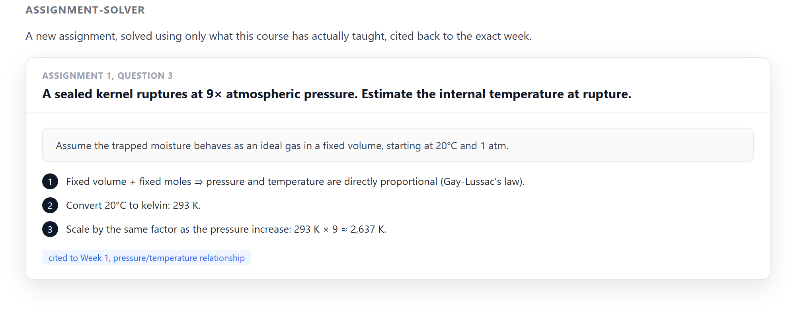

<!--
This README is the public-facing setup guide for people installing Barry from GitHub.
It does not describe the local/maintainer workflow. If you're developing Barry itself,
see SESSION_HANDOFF.md, GitHub To Be Pushed.md, and design-enrichment.md instead — this
file is intentionally generic and says nothing about the master/public-release branch
split, real course content under courses/**, or anything else specific to this machine's
setup.
-->

# Barry

**Barry doesn't summarize your lectures. He sits down next to you and explains them
properly.**

Claude Code skills that turn your own lecture material into full, worked-through study
documents: every definition kept, nothing skipped, real derivations, diagrams, and practice
questions layered on top.

 

[See it](#see-it) · [Install](#install) · [Skills](#skills) · [Subjects](#subjects) · [License](#license)

---

## See it

Take one concept: why popcorn pops. The source states it in one dense line:

> "Heating a kernel converts its trapped moisture to steam; when internal pressure exceeds
> the hull's tensile strength, it ruptures and the starch inverts."

Barry adds the buildup right where that line appears, not a rewritten version of it:

> **Intuitively:** every kernel holds a small amount of water sealed inside a hard outer
> hull. Heating that water past 100°C turns it to steam. Steam takes up roughly 1,000 times
> the volume of the same water as a liquid. Pressure inside the sealed hull climbs fast with
> nowhere to escape. The hull holds until it can't withstand the pressure any longer, then
> fails in one instant. That failure forces the starchy interior outward through the
> rupture.

*(Illustrative, written in Barry's actual tone-guide voice. Not pulled from a generated
file. For a full real example, see `samples/week1-enriched-sample.html`.)*

The original line stays in the document, in full, either way. The explanation sits
alongside it, never in place of it. Same for diagrams and practice questions: your own
lecture's content is never condensed or replaced, only built on.

## Install

You'll need [Claude Code](https://docs.claude.com/en/docs/claude-code) already set up: these
are Claude Code skills, not a standalone app. If you don't have it yet, set that up first.

Then:

```bash
git clone https://github.com/voditude/Barry-Bot.git
cp -r Barry-Bot/skills/* ~/.claude/skills/
```

That installs Barry for every project. To scope it to a single project instead, copy into
that project's `.claude/skills/` folder rather than `~/.claude/skills/`.

**First run:** give Barry your lecture material (slides, a transcript, whatever you have)
and ask it to run the `lesson-enrich` skill. Barry sets up the course folder for you. You
don't need to build any folder structure by hand.

The first time you use Barry at all, it asks a few quick questions: your name, field of
study, subjects. It also infers how you like things explained by showing you two ways of
describing an everyday concept and asking which one lands. That's a one-time setup,
remembered across every course after. Per course, it separately asks about background
level, explanation depth, and diagram density the first time you enrich a lecture from it.

## Skills

Every Barry skill produces a plain HTML file, so it's interactive like a website. Open one
in a browser and sections expand and collapse, diagrams zoom in, and math renders properly.
The whole thing is laid out and cross-linked like a real document. No additional setup
needed to view it. Open the file in any browser, keep it, or share it.

`transcript-slide-extract`, `lesson-enrich`, and `practice-weave` work together as one
pipeline. Your lecture's transcript, slides, and problem set normally sit in separate
files. These three skills weave them into a single additive document.




`i-dont-get-it` and `assignment-solver` build on top of that document once you have it.
One re-explains a single topic that isn't landing. The other solves a new assignment using
only what the course has actually taught.




*(Mockups showing the real layout and interactivity conventions. Not pulled from a
generated file.)*

| Skill | What it does |
|---|---|
| `lesson-enrich` | Turns a lecture's transcript/notes, slides, and problem set into one additive companion document. |
| `practice-weave` | Called by `lesson-enrich`. Weaves real problem-set questions in where their technique is introduced, generates new ones where the source has none, verifies every generated answer by running real code. |
| `transcript-slide-extract` | Called by `lesson-enrich` when a transcript is present. Cross-checks it against the slides and surfaces what the lecturer said that the slides don't cover. |
| `i-dont-get-it` | Stand-alone: a focused, first-principles explainer for one topic from an already-enriched lecture that still isn't landing. |
| `assignment-solver` | Takes a dropped assignment for a course Barry has already ingested and produces a full worked-solution document, cited back to the exact week. |

See each skill's `SKILL.md` for full detail, and `skills/*/reference/` for the design and
quality-bar references behind it.

## Subjects

Barry ships with a built-in baseline for Math, Economics & Finance, Law, Engineering,
Computer Science, and Marketing & Management. It already knows the conventions and tone
each field expects. If your subject isn't listed, or the baseline doesn't fit, tell Barry
what you're studying and it'll draft a starter pack on the spot.

## License

MIT. See `LICENSE`.
