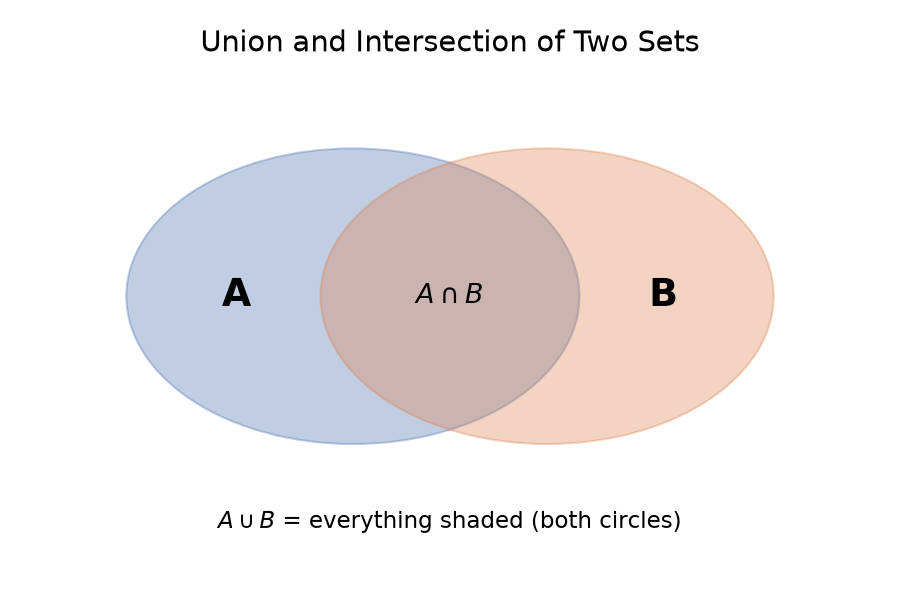

# &lt;course-id&gt; — Week 1 Enriched Lesson (SAMPLE — for scoping lesson-enrich)

*This is a hand-built worked example, not agent output. It exists to pin down what the
`lesson-enrich` skill should actually produce, structurally and in tone, before the skill
itself is written. Built from the course's own lecture notes PDF and problem-set solutions
PDF supplied for this project (filenames and course identity omitted from this public
copy).*

---

## Topic summary

Week 1 introduces the basic objects of enumerative combinatorics — **sets** (unordered,
no repeats) and **vectors/words** (ordered, repeats allowed) — and the four counting tools
used all semester: the **addition**, **multiplication**, **subtraction**, and **bijection**
principles. It ends by using these to count words over an alphabet under four kinds of
restriction (unrestricted, elementary restrictions, no repeats, subword avoidance), with the
birthday problem and pigeonhole principle as running examples.

---

## Sets vs. vectors — the one distinction everything else builds on

The lecture defines both back to back:

> *[Real lecture-notes quote omitted from this public copy — this was the source's own
> formal definition of a set and a vector, kept verbatim in the original version of this
> document.]*

**Intuition:** think of a set as *what's in your backpack* and a vector as *your itinerary
for the day*. `{Paris, Rome}` and `{Rome, Paris}` is the same backpack — doesn't matter what
order you name the cities in. But `(Paris, Rome)` and `(Rome, Paris)` are different
itineraries — one visits Paris first, the other Rome first. This is the entire reason the
course later gets two different counting formulas (`n^m` for words, `n!/(n-m)!` for
words-without-repeats vs. straight combinations) for what looks like "choosing things from a
group" — the moment you care about order, you're in vector/word land, not set land.

## Union and intersection — additive diagram

The notes give `A ∩ B = {c : c ∈ A and c ∈ B}` and `A ∪ B = {c : c ∈ A and/or c ∈ B}`
algebraically. A picture makes the addition principle's correction term click immediately:

*(generated via matplotlib — not in the original slides, added because the lecture states
the disjoint-sets addition principle `|A ∪ B| = |A| + |B|` without a picture, and the
overlap is exactly why that formula needs `A, B` disjoint in the first place.)*

## The multiplication principle → counting words

`|A × B| = |A||B|`, extended to `|A^(1) × ... × A^(n)| = ∏|A^(i)|`. The lecture's own worked
example is number plates: `letter·letter·letter·number·number·number` → `26³ · 10³`.

**Practice question, woven in here because it's the same principle applied one level up**
(from the official problem set — real question, official course solution, no disclaimer
needed):

> *[Real tutorial-question text omitted from this public copy.]*

Official solution: *[omitted along with the question it answers — it used the same
subtraction-principle move as the lecture's own worked example: count all strings, subtract
the ones that fail the restriction.]*

**Paired generated question** (practice-weave v1 — same technique, new scenario, answer
verified by running actual code, not asserted):

> A locker code uses length-5 strings over a 14-symbol alphabet (10 digits + 4 arrows). How
> many codes contain at least one digit **and** at least one arrow?

Generated answer — <strong>may be incorrect, verify against course materials</strong>

Two disjoint failure cases (all-arrows, all-digits — a code can't be both, so no overlap to
add back): `14⁵ − 4⁵ − 10⁵ = 436,800`. Verified against a brute-force small-case check in
`samples/practice-weave-verify-week1.py` — worth noting that a by-hand arithmetic slip during
drafting (`537,824` instead of `436,800`) was caught exactly by this verification step, which
is the whole point of not trusting a generated answer without running it.

See `samples/week1-enriched-sample.html` for the full v1 pass: two more concept points (Section 2
addition principle, Section 8 permutations) each get the same real+generated pairing, plus the
official-vs-generated provenance split (real answers unadorned, generated ones disclaimered)
applied consistently, and a worked example of the concept-tag manifest that matches real
questions to lecture sections
(`courses/<course-id>/week1-question-manifest.md`).

## Words without repeats and the birthday problem

*(unchanged from source — flagged here only to show where in the document a section can be
left as "just read the original," when the source's own explanation is already about as
clear as it gets and there's no clean additive angle. Not every section needs an analogy or
a diagram bolted on.)*

## Pigeonhole principle — first-principles aside

This term gets used without much ceremony in the notes ("if `m > n`, at least two people get
the same object"). Since it's the *first* time it's introduced in the course, per your
undergrad-level calibration this gets a first-principles build-up rather than assuming
familiarity:

**Why it's obviously true, before the formal statement:** if you have 5 pigeons and 4
holes, and every pigeon must go in a hole, you cannot possibly give each pigeon its own
hole — you only have 4. So some hole gets ≥ 2 pigeons. That's the whole idea; the "proof" in
the notes (the word-repetition phrasing) is just restating this in the language of words
over an alphabet, which is the same trick used everywhere else in Week 1: turn a counting
question into a question about words.

---

## What this sample is trying to demonstrate for scoping purposes

1. **Additive, not replacement:** the doc references the source ("the lecture's own worked
   example is...") rather than re-deriving everything from scratch, and explicitly skips
   enrichment where the source is already clear (see the "unchanged from source" note).
2. **Diagram generation is a real tool call**, not a described visual — the Venn diagram
   above was produced by `venn_diagram.py` via matplotlib, not written as prose.
3. **Practice weave is interleaved at the relevant concept**, not appended at the end — the
   password question sits right after the multiplication-principle section it reuses.
4. **Disclaimered answers are an inline, collapsible flag** on the specific question, not a
   banner — and, as of the practice-weave v1 pass, *only* on generated content. Real
   questions get their official course solution, undisclaimered.
5. **Undergrad-level calibration**: assumes 3rd-year background for things the course itself
   assumes (e.g. no re-explanation of what a function is), but goes first-principles for a
   concept flagged as newly introduced (pigeonhole).
6. **practice-weave v1**: generated questions are verified by running real code (sympy /
   brute-force enumeration) before being written down, not asserted by the model — see
   `samples/practice-weave-verify-week1.py`. This caught a genuine arithmetic error during
   drafting, which is exactly the failure mode the verification step exists to prevent.
